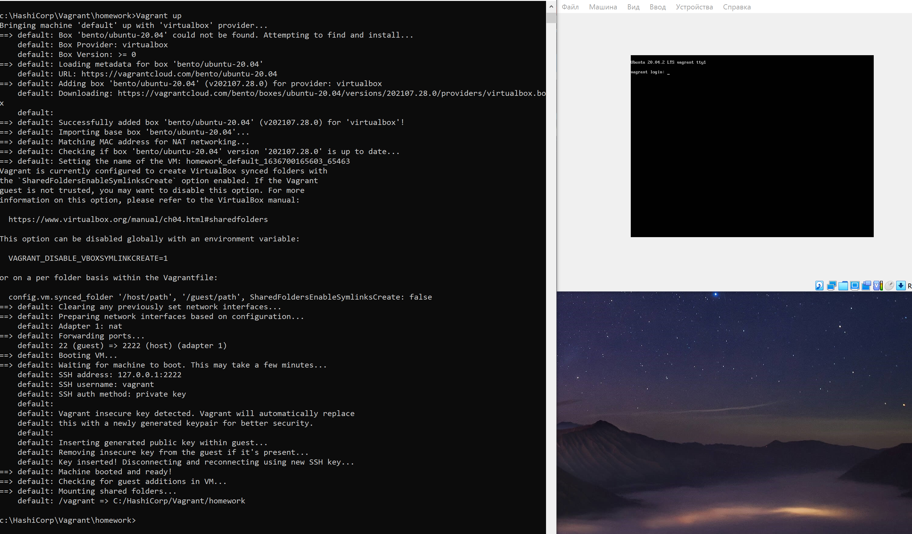
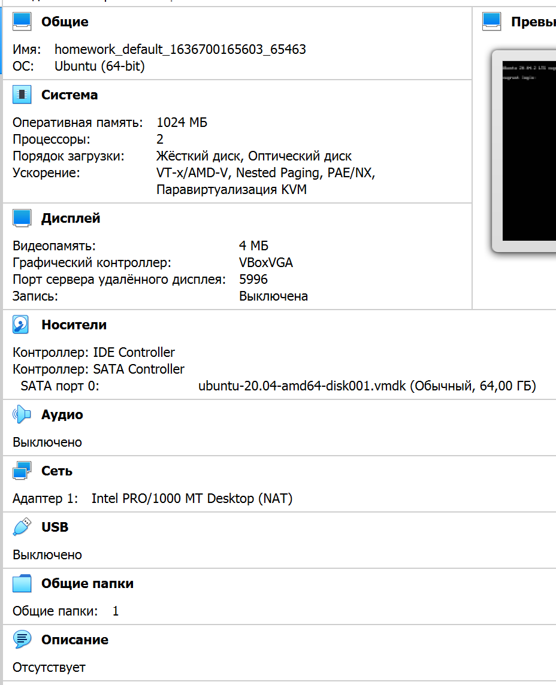

# devops-netology
Домашнее задание к занятию "3.1. Работа в терминале, лекция 1"
4. Команды создания машины из вагранта

5. Дефолтные параметры вирт. машины

6. Инструкции тут https://www.vagrantup.com/docs/providers/virtualbox/configuration

Кастомизация параметров машины производится через утилиту vboxmanage из состава virtualbox.

Vagrant предлагает метод обращения к этой утилите через конфигурационные файлы перед запуском машины.
Например vagrantfile такого содержания изменит размер ram и кол-во процессоров до 2048 и 2 соответственно у вышесозданной машины:

    Vagrant.configure("2") do |config|
        config.vm.box = "bento/ubuntu-20.04"
        config.vm.provider "virtualbox" do |v|
            v.memory = 2048
            v.cpus = 2
        end
    end

8. Строка 862, переменная HISTSIZE - число команд в истории, по умолчаниюю 500 команд 
Строка 846, переменная HISTFILESIZE - максимальное число строк в истории 

ignoreboth это сокращение для параметров ignorespace и ignoredups переменной HISTCONTROL

9. Строка 1091, раздел про раскрытие скобок

Необходимо для подстановки в команды элементов из списке, например команда "mkdir /home/user/{dir1,dir2,dir3}"
создаст три каталого в /home/user с названиями dir1, dir2 и dir3

10. Команда touch {000001..100000}.txt создаст 100 тысяч файлов с именем типа 000001.txt, 000002.txt и т.д.

Количество создаваемых файлов ограничено сверху как максимум файловой системой, также параметрами окружения (например /etc/security/limits.conf).

По умолчанию созданная машина имеет размер стека 8192 кБ (можно посмотреть командой 'ulimit -a'), при этом "количество файлов" максимально получилось сделать 147059.

    stack size              (kbytes, -s) 8192
  
Если увеличить стек до 65535 (командой 'ulimit -s 65535'), то количество файлов получается уже 426677.

11. Строка 269, 1818

Конструкция [[ -d /tmp ]] является условным выражением, проверяет, является ли /tmp папкой (через параметр -d) и возвращает 0 или 1 в зависимости от результата проверки
Можно использовать в скрипте типа:

Например в скрипте можно использовать так:

    if [[ -d /tmp ]]
    then
        echo "папка /tmp существует"
    else
        echo "папка /tmp не существует"
    fi

12. 
    vagrant@vagrant:~$ mkdir /tmp/new_path_directory  
    vagrant@vagrant:~$ cp /bin/bash /tmp/new_path_directory/  
    vagrant@vagrant:~$ PATH=/tmp/new_path_directory/:$PATH  
    vagrant@vagrant:~$ type -a bash  
    bash is /tmp/new_path_directory/bash  
    bash is /usr/bin/bash  
    bash is /bin/bash

13. at выполняет команду в определенное время  
batch выполняет команду при нагрузке системы менее 1.5

14. vagrant halt (выключение) или vagrant suspend (запись состояния и приостановка работы)

