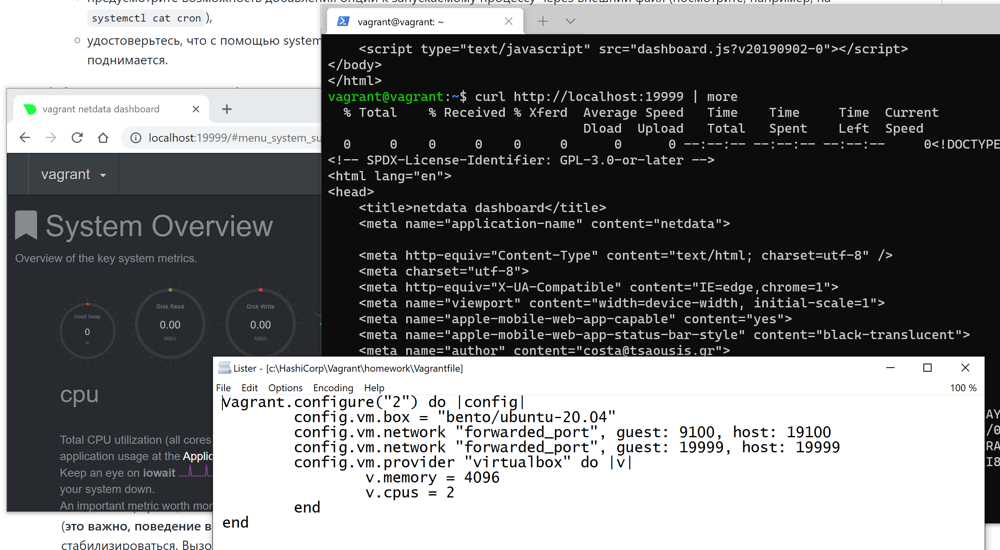

# Домашнее задание к занятию "3.4. Операционные системы, лекция 2"

1. На лекции мы познакомились с [node_exporter](https://github.com/prometheus/node_exporter/releases). В демонстрации его исполняемый файл запускался в background. Этого достаточно для демо, но не для настоящей production-системы, где процессы должны находиться под внешним управлением. Используя знания из лекции по systemd, создайте самостоятельно простой [unit-файл](https://www.freedesktop.org/software/systemd/man/systemd.service.html) для node_exporter:

    * поместите его в автозагрузку,
    * предусмотрите возможность добавления опций к запускаемому процессу через внешний файл (посмотрите, например, на `systemctl cat cron`),
    * удостоверьтесь, что с помощью systemctl процесс корректно стартует, завершается, а после перезагрузки автоматически поднимается.


      Ответ:
      
      скачиваем текущий node_exporter, копируем исполняемый файл в /opt/node_exporter
      $ wget https://github.com/prometheus/node_exporter/releases/download/v1.3.0/node_exporter-1.3.0.linux-amd64.tar.gz
      $ tar xvfz node_exporter-1.3.0.linux-amd64.tar.gz
      $ sudo mkdir /opt/node_exporter/
      $ sudo cp node_exporter-1.3.0.linux-amd64.tar.gz/node_exporter /opt/node_exporter/
      
      в свойствах vagrantfile настраиваем проброс порта 9100 гостя (порт по умолчанию node_exporter) на порт хоста 19100 (например):
      config.vm.network "forwarded_port", guest: 9100, host: 19100
  
      создаем отдельного пользователя, из-под которого будет запускаться сервис
      sudo useradd node_exporter -s /sbin/nologin
      
      создаем файл для указания настроек /etc/default/node_exporter
      создаем /etc/systemd/system/node_exporter.service файл для нашей службы ($OPTIONS указывает, что можно передать опции выполняемой команде через внешний файл /etc/default/node_exporter 
  
        [Unit]
        Description=Node Exporter
        
        [Service]
        User=node_exporter
        ExecStart=/opt/node_exporter/node_exporter $OPTIONS
        EnvironmentFile=/etc/default/node_exporter
        
        [Install]
        WantedBy=multi-user.target
      
      разрешаем службу
      sudo systemctl enable node_exporter
  
      после перезагрузки видим, что служба node_exporter успешно запустилась
      vagrant@vagrant:~$ systemctl status node_exporter
        ● node_exporter.service
           Loaded: loaded (/etc/systemd/system/node_exporter.service; enabled; vendor preset: enabled)
           Active: active (running)...
  
      node_exporter находится по адресам:
      http://localhost:9100/metrics (на госте)
      http://localhost:19100/metrics (на хосте)
   

3. Ознакомьтесь с опциями node_exporter и выводом `/metrics` по-умолчанию. Приведите несколько опций, которые вы бы выбрали для базового мониторинга хоста по CPU, памяти, диску и сети.


       Ответ:
       --collector.cpu  
       --collector.meminfo
       --collector.netstat
       --collector.filesystem
3. Установите в свою виртуальную машину [Netdata](https://github.com/netdata/netdata). Воспользуйтесь [готовыми пакетами](https://packagecloud.io/netdata/netdata/install) для установки (`sudo apt install -y netdata`). После успешной установки:
    * в конфигурационном файле `/etc/netdata/netdata.conf` в секции [web] замените значение с localhost на `bind to = 0.0.0.0`,
    * добавьте в Vagrantfile проброс порта Netdata на свой локальный компьютер и сделайте `vagrant reload`:

    ```bash
    config.vm.network "forwarded_port", guest: 19999, host: 19999
    ```

    После успешной перезагрузки в браузере *на своем ПК* (не в виртуальной машине) вы должны суметь зайти на `localhost:19999`. Ознакомьтесь с метриками, которые по умолчанию собираются Netdata и с комментариями, которые даны к этим метрикам.


       Ответ:
       

4. Можно ли по выводу `dmesg` понять, осознает ли ОС, что загружена не на настоящем оборудовании, а на системе виртуализации?
5. Как настроен sysctl `fs.nr_open` на системе по-умолчанию? Узнайте, что означает этот параметр. Какой другой существующий лимит не позволит достичь такого числа (`ulimit --help`)?
6. Запустите любой долгоживущий процесс (не `ls`, который отработает мгновенно, а, например, `sleep 1h`) в отдельном неймспейсе процессов; покажите, что ваш процесс работает под PID 1 через `nsenter`. Для простоты работайте в данном задании под root (`sudo -i`). Под обычным пользователем требуются дополнительные опции (`--map-root-user`) и т.д.
7. Найдите информацию о том, что такое `:(){ :|:& };:`. Запустите эту команду в своей виртуальной машине Vagrant с Ubuntu 20.04 (**это важно, поведение в других ОС не проверялось**). Некоторое время все будет "плохо", после чего (минуты) – ОС должна стабилизироваться. Вызов `dmesg` расскажет, какой механизм помог автоматической стабилизации. Как настроен этот механизм по-умолчанию, и как изменить число процессов, которое можно создать в сессии?
