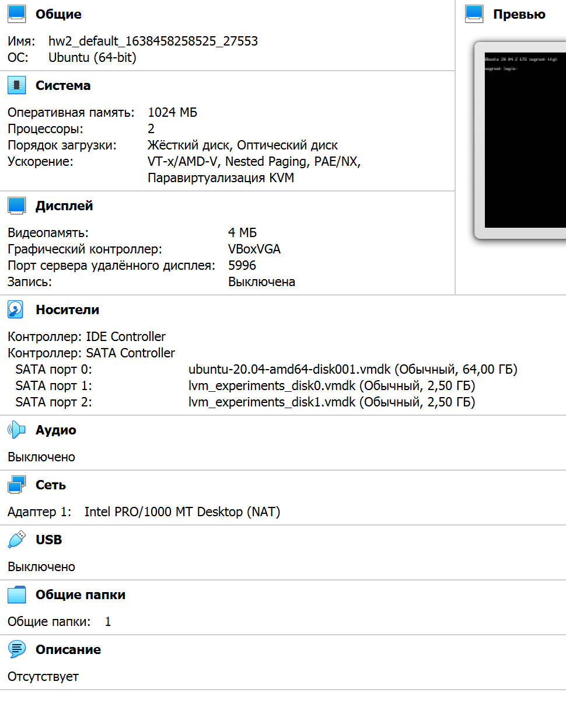

# Домашнее задание к занятию "3.5. Файловые системы"

1. Узнайте о [sparse](https://ru.wikipedia.org/wiki/%D0%A0%D0%B0%D0%B7%D1%80%D0%B5%D0%B6%D1%91%D0%BD%D0%BD%D1%8B%D0%B9_%D1%84%D0%B0%D0%B9%D0%BB) (разряженных) файлах.

2. Могут ли файлы, являющиеся жесткой ссылкой на один объект, иметь разные права доступа и владельца? Почему?

3. Сделайте `vagrant destroy` на имеющийся инстанс Ubuntu. Замените содержимое Vagrantfile следующим:

    ```bash
    Vagrant.configure("2") do |config|
      config.vm.box = "bento/ubuntu-20.04"
      config.vm.provider :virtualbox do |vb|
        lvm_experiments_disk0_path = "/tmp/lvm_experiments_disk0.vmdk"
        lvm_experiments_disk1_path = "/tmp/lvm_experiments_disk1.vmdk"
        vb.customize ['createmedium', '--filename', lvm_experiments_disk0_path, '--size', 2560]
        vb.customize ['createmedium', '--filename', lvm_experiments_disk1_path, '--size', 2560]
        vb.customize ['storageattach', :id, '--storagectl', 'SATA Controller', '--port', 1, '--device', 0, '--type', 'hdd', '--medium', lvm_experiments_disk0_path]
        vb.customize ['storageattach', :id, '--storagectl', 'SATA Controller', '--port', 2, '--device', 0, '--type', 'hdd', '--medium', lvm_experiments_disk1_path]
      end
    end
    ```

    Данная конфигурация создаст новую виртуальную машину с двумя дополнительными неразмеченными дисками по 2.5 Гб.
    
    ```
   Ответ: 
   Полученная машина
    ```
    

4. Используя `fdisk`, разбейте первый диск на 2 раздела: 2 Гб, оставшееся пространство.
```
на диске sdb создаем раздел sdb1 размером ~2G:

root@vagrant:~# fdisk -l
Disk /dev/sda: 64 GiB, 68719476736 bytes, 134217728 sectors
Disk model: VBOX HARDDISK
Units: sectors of 1 * 512 = 512 bytes
Sector size (logical/physical): 512 bytes / 512 bytes
I/O size (minimum/optimal): 512 bytes / 512 bytes
Disklabel type: dos
Disk identifier: 0x3f94c461

Device     Boot   Start       End   Sectors  Size Id Type
/dev/sda1  *       2048   1050623   1048576  512M  b W95 FAT32
/dev/sda2       1052670 134215679 133163010 63.5G  5 Extended
/dev/sda5       1052672 134215679 133163008 63.5G 8e Linux LVM


Disk /dev/sdb: 2.51 GiB, 2684354560 bytes, 5242880 sectors
Disk model: VBOX HARDDISK
Units: sectors of 1 * 512 = 512 bytes
Sector size (logical/physical): 512 bytes / 512 bytes
I/O size (minimum/optimal): 512 bytes / 512 bytes


Disk /dev/sdc: 2.51 GiB, 2684354560 bytes, 5242880 sectors
Disk model: VBOX HARDDISK
Units: sectors of 1 * 512 = 512 bytes
Sector size (logical/physical): 512 bytes / 512 bytes
I/O size (minimum/optimal): 512 bytes / 512 bytes


Disk /dev/mapper/vgvagrant-root: 62.55 GiB, 67150807040 bytes, 131153920 sectors
Units: sectors of 1 * 512 = 512 bytes
Sector size (logical/physical): 512 bytes / 512 bytes
I/O size (minimum/optimal): 512 bytes / 512 bytes


Disk /dev/mapper/vgvagrant-swap_1: 980 MiB, 1027604480 bytes, 2007040 sectors
Units: sectors of 1 * 512 = 512 bytes
Sector size (logical/physical): 512 bytes / 512 bytes
I/O size (minimum/optimal): 512 bytes / 512 bytes
root@vagrant:~# fdisk /dev/sdb

Welcome to fdisk (util-linux 2.34).
Changes will remain in memory only, until you decide to write them.
Be careful before using the write command.

Device does not contain a recognized partition table.
Created a new DOS disklabel with disk identifier 0x1117bd22.

Command (m for help): n
Partition type
   p   primary (0 primary, 0 extended, 4 free)
   e   extended (container for logical partitions)
Select (default p): p
Partition number (1-4, default 1):
First sector (2048-5242879, default 2048):
Last sector, +/-sectors or +/-size{K,M,G,T,P} (2048-5242879, default 5242879): 4192256

Created a new partition 1 of type 'Linux' and of size 2 GiB.

Command (m for help): w
The partition table has been altered.
Calling ioctl() to re-read partition table.
Syncing disks.

root@vagrant:~# fdisk -l
Disk /dev/sda: 64 GiB, 68719476736 bytes, 134217728 sectors
Disk model: VBOX HARDDISK
Units: sectors of 1 * 512 = 512 bytes
Sector size (logical/physical): 512 bytes / 512 bytes
I/O size (minimum/optimal): 512 bytes / 512 bytes
Disklabel type: dos
Disk identifier: 0x3f94c461

Device     Boot   Start       End   Sectors  Size Id Type
/dev/sda1  *       2048   1050623   1048576  512M  b W95 FAT32
/dev/sda2       1052670 134215679 133163010 63.5G  5 Extended
/dev/sda5       1052672 134215679 133163008 63.5G 8e Linux LVM


Disk /dev/sdb: 2.51 GiB, 2684354560 bytes, 5242880 sectors
Disk model: VBOX HARDDISK
Units: sectors of 1 * 512 = 512 bytes
Sector size (logical/physical): 512 bytes / 512 bytes
I/O size (minimum/optimal): 512 bytes / 512 bytes
Disklabel type: dos
Disk identifier: 0x1117bd22

Device     Boot Start     End Sectors Size Id Type
/dev/sdb1        2048 4192256 4190209   2G 83 Linux


Disk /dev/sdc: 2.51 GiB, 2684354560 bytes, 5242880 sectors
Disk model: VBOX HARDDISK
Units: sectors of 1 * 512 = 512 bytes
Sector size (logical/physical): 512 bytes / 512 bytes
I/O size (minimum/optimal): 512 bytes / 512 bytes


Disk /dev/mapper/vgvagrant-root: 62.55 GiB, 67150807040 bytes, 131153920 sectors
Units: sectors of 1 * 512 = 512 bytes
Sector size (logical/physical): 512 bytes / 512 bytes
I/O size (minimum/optimal): 512 bytes / 512 bytes


Disk /dev/mapper/vgvagrant-swap_1: 980 MiB, 1027604480 bytes, 2007040 sectors
Units: sectors of 1 * 512 = 512 bytes
Sector size (logical/physical): 512 bytes / 512 bytes
I/O size (minimum/optimal): 512 bytes / 512 bytes
```
5. Используя `sfdisk`, перенесите данную таблицу разделов на второй диск.
```
root@vagrant:~# sfdisk -d /dev/sdb|sfdisk /dev/sdc
Checking that no-one is using this disk right now ... OK

Disk /dev/sdc: 2.51 GiB, 2684354560 bytes, 5242880 sectors
Disk model: VBOX HARDDISK
Units: sectors of 1 * 512 = 512 bytes
Sector size (logical/physical): 512 bytes / 512 bytes
I/O size (minimum/optimal): 512 bytes / 512 bytes
Disklabel type: dos
Disk identifier: 0x519096eb

Old situation:

>>> Script header accepted.
>>> Script header accepted.
>>> Script header accepted.
>>> Script header accepted.
>>> Created a new DOS disklabel with disk identifier 0x1117bd22.
/dev/sdc1: Created a new partition 1 of type 'Linux' and of size 2 GiB.
/dev/sdc2: Created a new partition 2 of type 'Linux' and of size 512 MiB.
/dev/sdc3: Done.

New situation:
Disklabel type: dos
Disk identifier: 0x1117bd22

Device     Boot   Start     End Sectors  Size Id Type
/dev/sdc1          2048 4192256 4190209    2G 83 Linux
/dev/sdc2       4194304 5242879 1048576  512M 83 Linux

The partition table has been altered.
Calling ioctl() to re-read partition table.
Syncing disks.
```

6. Соберите `mdadm` RAID1 на паре разделов 2 Гб.
```
root@vagrant:~# mdadm --create /dev/md1 --level=1 --raid-devices=2 /dev/sdb1 /dev/sdc1
mdadm: Note: this array has metadata at the start and
    may not be suitable as a boot device.  If you plan to
    store '/boot' on this device please ensure that
    your boot-loader understands md/v1.x metadata, or use
    --metadata=0.90
Continue creating array? y
mdadm: Defaulting to version 1.2 metadata
mdadm: array /dev/md1 started.
```
7. Соберите `mdadm` RAID0 на второй паре маленьких разделов.
```
root@vagrant:~# mdadm --create /dev/md0 --level=0 --raid-devices=2 /dev/sdb2 /dev/sdc2
mdadm: partition table exists on /dev/sdb2
mdadm: partition table exists on /dev/sdb2 but will be lost or
       meaningless after creating array
mdadm: partition table exists on /dev/sdc2
mdadm: partition table exists on /dev/sdc2 but will be lost or
       meaningless after creating array
Continue creating array? y
mdadm: Defaulting to version 1.2 metadata
mdadm: array /dev/md0 started.
```
8. Создайте 2 независимых PV на получившихся md-устройствах.
```
root@vagrant:~# pvcreate /dev/md0 /dev/md1
  Physical volume "/dev/md0" successfully created.
  Physical volume "/dev/md1" successfully created.
```
9. Создайте общую volume-group на этих двух PV.
```
root@vagrant:~# vgcreate vg /dev/md0 /dev/md1
  Volume group "vg" successfully created
root@vagrant:~# vgdisplay
  --- Volume group ---
  VG Name               vgvagrant
  System ID
  Format                lvm2
  Metadata Areas        1
  Metadata Sequence No  3
  VG Access             read/write
  VG Status             resizable
  MAX LV                0
  Cur LV                2
  Open LV               2
  Max PV                0
  Cur PV                1
  Act PV                1
  VG Size               <63.50 GiB
  PE Size               4.00 MiB
  Total PE              16255
  Alloc PE / Size       16255 / <63.50 GiB
  Free  PE / Size       0 / 0
  VG UUID               PaBfZ0-3I0c-iIdl-uXKt-JL4K-f4tT-kzfcyE

  --- Volume group ---
  VG Name               vg
  System ID
  Format                lvm2
  Metadata Areas        2
  Metadata Sequence No  1
  VG Access             read/write
  VG Status             resizable
  MAX LV                0
  Cur LV                0
  Open LV               0
  Max PV                0
  Cur PV                2
  Act PV                2
  VG Size               2.98 GiB
  PE Size               4.00 MiB
  Total PE              764
  Alloc PE / Size       0 / 0
  Free  PE / Size       764 / 2.98 GiB
  VG UUID               GLkAUK-siW2-wtk0-fgz1-ua0G-7aul-TCbEkL  
```
10. Создайте LV размером 100 Мб, указав его расположение на PV с RAID0.
```
root@vagrant:~# lvcreate --size 100M vg /dev/md0
  Logical volume "lvol0" created.
```
11. Создайте `mkfs.ext4` ФС на получившемся LV.
```
root@vagrant:~# mkfs -t ext4 /dev/vg/lvol0
mke2fs 1.45.5 (07-Jan-2020)
Creating filesystem with 25600 4k blocks and 25600 inodes

Allocating group tables: done
Writing inode tables: done
Creating journal (1024 blocks): done
Writing superblocks and filesystem accounting information: done
```
12. Смонтируйте этот раздел в любую директорию, например, `/tmp/new`.
```
root@vagrant:~# mkdir /tmp/new
root@vagrant:~# mount /dev/vg/lvol0 /tmp/new
```
13. Поместите туда тестовый файл, например `wget https://mirror.yandex.ru/ubuntu/ls-lR.gz -O /tmp/new/test.gz`.
```
root@vagrant:/tmp/new# wget https://mirror.yandex.ru/ubuntu/ls-lR.gz -O /tmp/new/test.gz
--2021-12-04 17:31:24--  https://mirror.yandex.ru/ubuntu/ls-lR.gz
Resolving mirror.yandex.ru (mirror.yandex.ru)... 213.180.204.183, 2a02:6b8::183
Connecting to mirror.yandex.ru (mirror.yandex.ru)|213.180.204.183|:443... connected.
HTTP request sent, awaiting response... 200 OK
Length: 22674002 (22M) [application/octet-stream]
Saving to: ‘/tmp/new/test.gz’

/tmp/new/test.gz              100%[=================================================>]  21.62M   837KB/s    in 26s

2021-12-04 17:31:51 (840 KB/s) - ‘/tmp/new/test.gz’ saved [22674002/22674002]
```
14. Прикрепите вывод `lsblk`.
```
root@vagrant:/tmp/new# lsblk
NAME                 MAJ:MIN RM  SIZE RO TYPE  MOUNTPOINT
sda                    8:0    0   64G  0 disk
├─sda1                 8:1    0  512M  0 part  /boot/efi
├─sda2                 8:2    0    1K  0 part
└─sda5                 8:5    0 63.5G  0 part
  ├─vgvagrant-root   253:0    0 62.6G  0 lvm   /
  └─vgvagrant-swap_1 253:1    0  980M  0 lvm   [SWAP]
sdb                    8:16   0  2.5G  0 disk
├─sdb1                 8:17   0    2G  0 part
│ └─md1                9:1    0    2G  0 raid1
└─sdb2                 8:18   0  512M  0 part
  └─md0                9:0    0 1020M  0 raid0
    └─vg-lvol0       253:2    0  100M  0 lvm   /tmp/new
sdc                    8:32   0  2.5G  0 disk
├─sdc1                 8:33   0    2G  0 part
│ └─md1                9:1    0    2G  0 raid1
└─sdc2                 8:34   0  512M  0 part
  └─md0                9:0    0 1020M  0 raid0
    └─vg-lvol0       253:2    0  100M  0 lvm   /tmp/new
```
15. Протестируйте целостность файла:

     ```bash
     root@vagrant:~# gzip -t /tmp/new/test.gz
     root@vagrant:~# echo $?
     0
     ```
```
root@vagrant:/tmp/new# gzip -t /tmp/new/test.gz && echo $?
0
```
16. Используя pvmove, переместите содержимое PV с RAID0 на RAID1.
```
root@vagrant:/tmp/new# pvmove /dev/md0
  /dev/md0: Moved: 100.00%
root@vagrant:/tmp/new# cd ~/.
root@vagrant:~# lsblk
NAME                 MAJ:MIN RM  SIZE RO TYPE  MOUNTPOINT
sda                    8:0    0   64G  0 disk
├─sda1                 8:1    0  512M  0 part  /boot/efi
├─sda2                 8:2    0    1K  0 part
└─sda5                 8:5    0 63.5G  0 part
  ├─vgvagrant-root   253:0    0 62.6G  0 lvm   /
  └─vgvagrant-swap_1 253:1    0  980M  0 lvm   [SWAP]
sdb                    8:16   0  2.5G  0 disk
├─sdb1                 8:17   0    2G  0 part
│ └─md1                9:1    0    2G  0 raid1
│   └─vg-lvol0       253:2    0  100M  0 lvm   /tmp/new
└─sdb2                 8:18   0  512M  0 part
  └─md0                9:0    0 1020M  0 raid0
sdc                    8:32   0  2.5G  0 disk
├─sdc1                 8:33   0    2G  0 part
│ └─md1                9:1    0    2G  0 raid1
│   └─vg-lvol0       253:2    0  100M  0 lvm   /tmp/new
└─sdc2                 8:34   0  512M  0 part
  └─md0                9:0    0 1020M  0 raid0
```
17. Сделайте `--fail` на устройство в вашем RAID1 md.
```
root@vagrant:~# mdadm /dev/md1 --fail /dev/sdb1
  mdadm: set /dev/sdb1 faulty in /dev/md1

```
18. Подтвердите выводом `dmesg`, что RAID1 работает в деградированном состоянии.
```
root@vagrant:~# dmesg | grep raid1
[  168.398543] md/raid1:md1: not clean -- starting background reconstruction
[  168.398544] md/raid1:md1: active with 2 out of 2 mirrors
[ 1034.280055] md/raid1:md1: Disk failure on sdb1, disabling device.
               md/raid1:md1: Operation continuing on 1 devices.
```
19. Протестируйте целостность файла, несмотря на "сбойный" диск он должен продолжать быть доступен:

     ```bash
     root@vagrant:~# gzip -t /tmp/new/test.gz
     root@vagrant:~# echo $?
     0
     ```
```
root@vagrant:~# gzip -t /tmp/new/test.gz && echo $?
0
```
20. Погасите тестовый хост, `vagrant destroy`.
```
PS C:\HashiCorp\Vagrant\hw2> vagrant destroy
    default: Are you sure you want to destroy the 'default' VM? [y/N] ==> default: Destroying VM and associated drives...
PS C:\HashiCorp\Vagrant\hw2>
```

