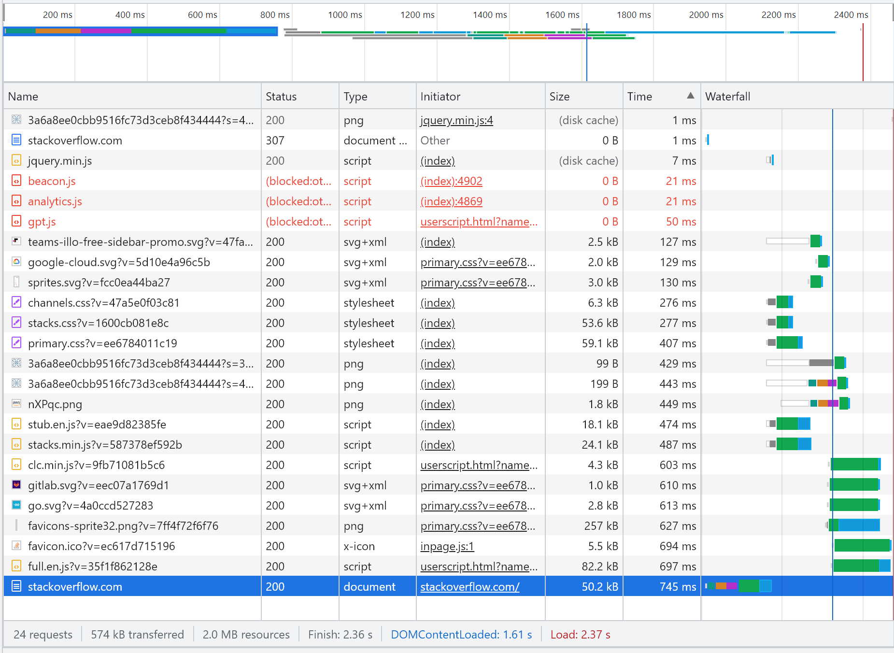
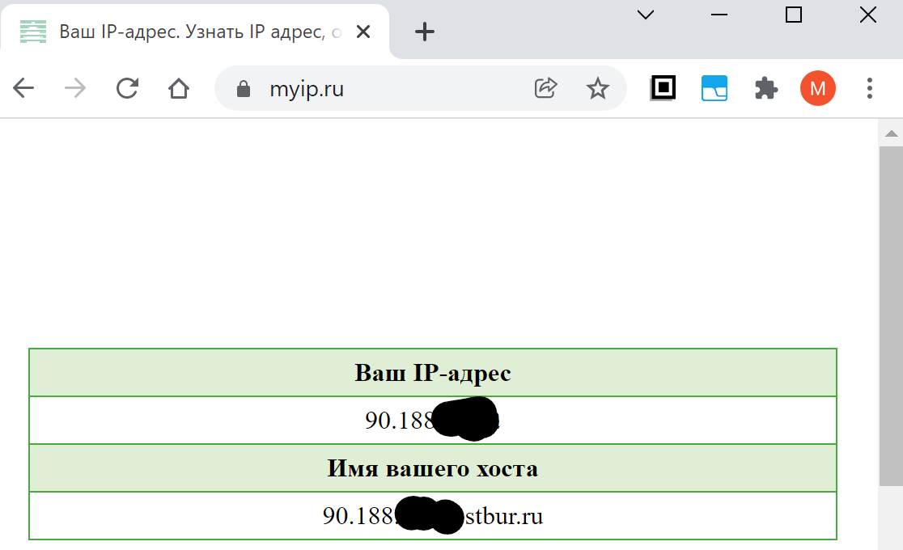

# Домашнее задание к занятию "3.6. Компьютерные сети, лекция 1"

1. Работа c HTTP через телнет.
- Подключитесь утилитой телнет к сайту stackoverflow.com
`telnet stackoverflow.com 80`
- отправьте HTTP запрос
```bash
GET /questions HTTP/1.0
HOST: stackoverflow.com
[press enter]
[press enter]
```
- В ответе укажите полученный HTTP код, что он означает?
```
root@CORE-I7:~# telnet stackoverflow.com 80
Trying 151.101.129.69...
Connected to stackoverflow.com.
Escape character is '^]'.
GET /questions HTTP/1.0
HOST: stackoverflow.com

HTTP/1.1 301 Moved Permanently
cache-control: no-cache, no-store, must-revalidate
location: https://stackoverflow.com/questions
x-request-guid: 83c6b9c2-1f7f-4755-8152-ec8c2a48d7ca
feature-policy: microphone 'none'; speaker 'none'
content-security-policy: upgrade-insecure-requests; frame-ancestors 'self' https://stackexchange.com
Accept-Ranges: bytes
Date: Thu, 09 Dec 2021 15:32:48 GMT
Via: 1.1 varnish
Connection: close
X-Served-By: cache-ams21037-AMS
X-Cache: MISS
X-Cache-Hits: 0
X-Timer: S1639063968.365914,VS0,VE74
Vary: Fastly-SSL
X-DNS-Prefetch-Control: off
Set-Cookie: prov=41149d4b-13bc-c5c7-7613-edb15e5b5023; domain=.stackoverflow.com; expires=Fri, 01-Jan-2055 00:00:00 GMT; path=/; HttpOnly

Connection closed by foreign host.


Получили HTTP/1.1 301 Moved Permanently - т.е. код 301 "перемещен навсегда"
в данном случае страница http://stackoverflow.com/questions перемещена на https://stackoverflow.com/questions
```
2. Повторите задание 1 в браузере, используя консоль разработчика F12.
- откройте вкладку `Network`
- отправьте запрос http://stackoverflow.com
- найдите первый ответ HTTP сервера, откройте вкладку `Headers`
- укажите в ответе полученный HTTP код.
- проверьте время загрузки страницы, какой запрос обрабатывался дольше всего?
- приложите скриншот консоли браузера в ответ.
```
Request URL: http://stackoverflow.com/
Request Method: GET
Status Code: 307 Internal Redirect

время загрузки страницы 2.37 сек
дольше всего выполнялся запрос document со временем 745 мс
```


3. Какой IP адрес у вас в интернете?
```
90.188.*.*
```

4. Какому провайдеру принадлежит ваш IP адрес? Какой автономной системе AS? Воспользуйтесь утилитой `whois`
```
root@CORE-I7:~# whois 90.188.*.*
% This is the RIPE Database query service.
% The objects are in RPSL format.
%
% The RIPE Database is subject to Terms and Conditions.
% See http://www.ripe.net/db/support/db-terms-conditions.pdf

% Note: this output has been filtered.
%       To receive output for a database update, use the "-B" flag.

% Information related to '90.188.32.0 - 90.188.53.255'

% Abuse contact for '90.188.32.0 - 90.188.53.255' is 'abuse@rt.ru'

inetnum:        90.188.32.0 - 90.188.53.255
netname:        WEBSTREAM
descr:          OJSC "Sibirtelecom"
remarks:        Buryat branch
country:        RU
remarks:
remarks:        NCC#2006113119
remarks:        INFRA AW
remarks:
admin-c:        NSOE11-RIPE
tech-c:         NSOE22-RIPE
mnt-by:         NSOELSV-NCC
mnt-domains:    NSOELSV-NCC
mnt-routes:     NSOELSV-NCC
status:         ASSIGNED PA
remarks:
remarks:        Direct reference for the general info on spam
remarks:        In unsoluble cases for the general info on spam,
remarks:        abusing & hacking complaints email abuse@sinor.ru
remarks:
created:        2006-11-20T08:40:05Z
last-modified:  2019-05-21T04:55:03Z
source:         RIPE # Filtered

role:           NSOELSVZ admin-c role
address:        JSC "Sibirtelecom"
address:        18, Ordjenikidze str.,
address:        630099,  Novosibirsk, Russia
phone:          +7 383 2 270669
fax-no:         +7 383 2 270017
admin-c:        YOL1-RIPE
admin-c:        VIK15-RIPE
tech-c:         YOL1-RIPE
tech-c:         VIK15-RIPE
nic-hdl:        NSOE11-RIPE
mnt-by:         NSOELSV-NCC
created:        2005-03-29T04:58:27Z
last-modified:  2008-09-08T05:37:10Z
source:         RIPE # Filtered

role:           NSOELSVZ tech-c role
address:        JSC "Sibirtelecom"
address:        18, Ordjenikidze str.,
address:        630099,  Novosibirsk, Russia
phone:          +7 383 2 270669
fax-no:         +7 383 2 270017
admin-c:        YOL1-RIPE
admin-c:        VIK15-RIPE
tech-c:         YOL1-RIPE
tech-c:         VIK15-RIPE
nic-hdl:        NSOE22-RIPE
mnt-by:         NSOELSV-NCC
created:        2005-03-29T04:55:41Z
last-modified:  2008-09-08T05:37:11Z
source:         RIPE # Filtered

% Information related to '90.188.32.0/19AS39054'

route:          90.188.32.0/19
descr:          JSC "Sibirtelecom" Buryat branch
origin:         AS39054
mnt-by:         NSOELSV-NCC
created:        2006-11-20T10:42:20Z
last-modified:  2006-11-20T10:42:20Z
source:         RIPE

% This query was served by the RIPE Database Query Service version 1.102 (ANGUS)

провайдер Ростелеком, но здесь указаны старые данные, ОАО Сибирьтелеком (давно уже часть Ростелекома)
автономная система AS39054
```
5. Через какие сети проходит пакет, отправленный с вашего компьютера на адрес 8.8.8.8? Через какие AS? Воспользуйтесь утилитой `traceroute`
```
root@CORE-I7:~# traceroute -An 8.8.8.8
traceroute to 8.8.8.8 (8.8.8.8), 30 hops max, 60 byte packets
 1  172.21.176.1 [*]  0.270 ms  0.243 ms  0.243 ms
 2  10.10.25.1 [*]  0.760 ms  0.574 ms  0.633 ms
 3  213.228.116.203 [AS12389]  2.284 ms  2.211 ms  2.236 ms
 4  213.228.114.4 [AS12389]  5.607 ms  5.661 ms  5.557 ms
 5  * * 87.226.181.89 [AS12389]  76.075 ms
 6  5.143.253.105 [AS12389]  69.442 ms  73.271 ms 5.143.253.245 [AS12389]  72.923 ms
 7  * 108.170.250.113 [AS15169]  69.732 ms  78.920 ms
 8  * 209.85.255.136 [AS15169]  83.541 ms 172.253.66.116 [AS15169]  94.744 ms
 9  172.253.66.108 [AS15169]  126.678 ms 74.125.253.109 [AS15169]  86.948 ms 108.170.235.64 [AS15169]  90.839 ms
10  216.239.56.101 [AS15169]  82.328 ms 172.253.51.187 [AS15169]  93.249 ms 142.250.236.77 [AS15169]  88.070 ms
11  * * *
12  * * *
13  * * *
14  * * *
15  * * *
16  * * *
17  * * *
18  * * *
19  * * 8.8.8.8 [AS15169]  98.442 ms
```
6. Повторите задание 5 в утилите `mtr`. На каком участке наибольшая задержка - delay?
```
                                                 My traceroute  [v0.93]
CORE-I7 (172.21.183.11)                                                                        2021-12-09T23:53:16+0800
Keys:  Help   Display mode   Restart statistics   Order of fields   quit
                                                                               Packets               Pings
 Host                                                                        Loss%   Snt   Last   Avg  Best  Wrst StDev
 1. AS???    CORE-I7                                                          0.0%    35    0.2   0.3   0.1   0.8   0.2
 2. AS???    10.10.25.1                                                       0.0%    35    0.4   0.5   0.3   1.7   0.3
 3. AS12389  ulnd-bras3.sib.ip.rostelecom.ru                                  0.0%    35    1.3   5.2   1.1  22.2   5.4
 4. AS12389  xe-1-1-0.ulnd-rgr5.sib.ip.rostelecom.ru                          0.0%    35    2.8   9.4   1.1  46.9  11.2
 5. AS12389  87.226.183.89                                                    0.0%    35   72.7  78.4  72.6  94.8   6.7
 6. AS12389  5.143.253.245                                                    0.0%    35   77.4  85.0  77.0 185.2  18.6
 7. AS15169  108.170.250.99                                                   0.0%    35   77.0  79.1  76.9  93.5   3.0
 8. AS15169  172.253.66.116                                                   0.0%    35   94.7 109.2  94.5 196.6  26.7
 9. AS15169  172.253.66.108                                                   0.0%    35   87.0  96.1  86.7 157.0  13.1
10. AS15169  142.250.210.45                                                   0.0%    35   88.7  91.1  87.6 104.7   4.0
11. (waiting for reply)
12. (waiting for reply)
13. (waiting for reply)
14. (waiting for reply)
15. (waiting for reply)
16. (waiting for reply)
17. (waiting for reply)
18. (waiting for reply)
19. AS15169  dns.google                                                      90.9%    34   90.6  92.1  90.6  93.8   1.6

наибольшая средняя задержка на 172.253.66.116, около 109 мс
```
7. Какие DNS сервера отвечают за доменное имя dns.google? Какие A записи? воспользуйтесь утилитой `dig`
```
root@CORE-I7:~# dig dns.google

; <<>> DiG 9.16.1-Ubuntu <<>> dns.google
;; global options: +cmd
;; Got answer:
;; ->>HEADER<<- opcode: QUERY, status: NOERROR, id: 64163
;; flags: qr rd ad; QUERY: 1, ANSWER: 2, AUTHORITY: 0, ADDITIONAL: 0
;; WARNING: recursion requested but not available

;; QUESTION SECTION:
;dns.google.                    IN      A

;; ANSWER SECTION:
dns.google.             0       IN      A       8.8.8.8
dns.google.             0       IN      A       8.8.4.4

;; Query time: 100 msec
;; SERVER: 172.21.176.1#53(172.21.176.1)
;; WHEN: Thu Dec 09 23:55:13 +08 2021
;; MSG SIZE  rcvd: 70

DNS сервера 8.8.8.8 и 8.8.4.4
```
8. Проверьте PTR записи для IP адресов из задания 7. Какое доменное имя привязано к IP? воспользуйтесь утилитой `dig`
```
root@CORE-I7:~# dig -x 8.8.8.8

; <<>> DiG 9.16.1-Ubuntu <<>> -x 8.8.8.8
;; global options: +cmd
;; Got answer:
;; ->>HEADER<<- opcode: QUERY, status: NOERROR, id: 34912
;; flags: qr rd ad; QUERY: 1, ANSWER: 1, AUTHORITY: 0, ADDITIONAL: 0
;; WARNING: recursion requested but not available

;; QUESTION SECTION:
;8.8.8.8.in-addr.arpa.          IN      PTR

;; ANSWER SECTION:
8.8.8.8.in-addr.arpa.   0       IN      PTR     dns.google.

;; Query time: 0 msec
;; SERVER: 172.21.176.1#53(172.21.176.1)
;; WHEN: Thu Dec 09 23:58:22 +08 2021
;; MSG SIZE  rcvd: 82

root@CORE-I7:~# dig -x 8.8.4.4

; <<>> DiG 9.16.1-Ubuntu <<>> -x 8.8.4.4
;; global options: +cmd
;; Got answer:
;; ->>HEADER<<- opcode: QUERY, status: NOERROR, id: 5910
;; flags: qr rd ad; QUERY: 1, ANSWER: 3, AUTHORITY: 0, ADDITIONAL: 0
;; WARNING: recursion requested but not available

;; QUESTION SECTION:
;4.4.8.8.in-addr.arpa.          IN      PTR

;; ANSWER SECTION:
4.4.8.8.in-addr.arpa.   0       IN      PTR     dns.google.
dns.google.             0       IN      A       8.8.8.8
dns.google.             0       IN      A       8.8.4.4

;; Query time: 110 msec
;; SERVER: 172.21.176.1#53(172.21.176.1)
;; WHEN: Thu Dec 09 23:58:33 +08 2021
;; MSG SIZE  rcvd: 124

привязан домен dns.google
```