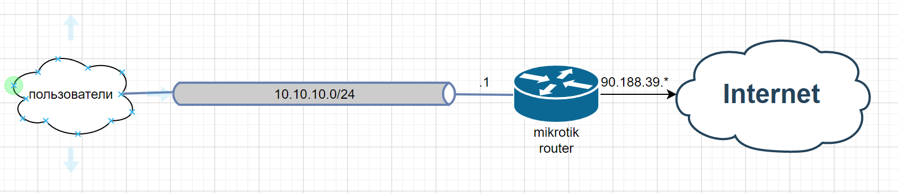

# Домашнее задание к занятию "3.8. Компьютерные сети, лекция 3"

1. Подключитесь к публичному маршрутизатору в интернет. Найдите маршрут к вашему публичному IP
```
telnet route-views.routeviews.org
Username: rviews
show ip route x.x.x.x
route-views>show ip route 90.188.*.*
Routing entry for 90.188.32.0/19
  Known via "bgp 6447", distance 20, metric 0
  Tag 6939, type external
  Last update from 64.71.137.241 01:04:39 ago
  Routing Descriptor Blocks:
  * 64.71.137.241, from 64.71.137.241, 01:04:39 ago
      Route metric is 0, traffic share count is 1
      AS Hops 2
      Route tag 6939
      MPLS label: none

route-views>show bgp 90.188.*.*
BGP routing table entry for 90.188.32.0/19, version 1442343038
Paths: (23 available, best #22, table default)
  Not advertised to any peer
  Refresh Epoch 1
  20912 3257 3356 12389
    212.66.96.126 from 212.66.96.126 (212.66.96.126)
      Origin IGP, localpref 100, valid, external
      Community: 3257:8070 3257:30515 3257:50001 3257:53900 3257:53902 20912:65004
      path 7FE132EBFDD0 RPKI State valid
      rx pathid: 0, tx pathid: 0
  Refresh Epoch 1
  3333 1103 12389
    193.0.0.56 from 193.0.0.56 (193.0.0.56)
      Origin IGP, localpref 100, valid, external
      path 7FE10AC0E840 RPKI State valid
      rx pathid: 0, tx pathid: 0
  Refresh Epoch 1
  8283 1299 12389
    94.142.247.3 from 94.142.247.3 (94.142.247.3)
      Origin IGP, metric 0, localpref 100, valid, external
      Community: 1299:30000 8283:1 8283:101 8283:103
      unknown transitive attribute: flag 0xE0 type 0x20 length 0x24
        value 0000 205B 0000 0000 0000 0001 0000 205B
              0000 0005 0000 0001 0000 205B 0000 0005
              0000 0003
      path 7FE03CB35A50 RPKI State valid
      rx pathid: 0, tx pathid: 0
  Refresh Epoch 1
  53767 14315 6453 6453 3356 12389
    162.251.163.2 from 162.251.163.2 (162.251.162.3)
      Origin IGP, localpref 100, valid, external
      Community: 14315:5000 53767:5000
      path 7FE0B6906D08 RPKI State valid
      rx pathid: 0, tx pathid: 0
  Refresh Epoch 1
  3356 12389
    4.68.4.46 from 4.68.4.46 (4.69.184.201)
      Origin IGP, metric 0, localpref 100, valid, external
      Community: 3356:2 3356:22 3356:100 3356:123 3356:501 3356:901 3356:2065
      path 7FE1457803C8 RPKI State valid
      rx pathid: 0, tx pathid: 0
  Refresh Epoch 1
  20130 6939 12389
    140.192.8.16 from 140.192.8.16 (140.192.8.16)
      Origin IGP, localpref 100, valid, external
      path 7FE0EB179448 RPKI State valid
      rx pathid: 0, tx pathid: 0
  Refresh Epoch 1
  3549 3356 12389
    208.51.134.254 from 208.51.134.254 (67.16.168.191)
      Origin IGP, metric 0, localpref 100, valid, external
      Community: 3356:2 3356:22 3356:100 3356:123 3356:501 3356:901 3356:2065 3549:2581 3549:30840
      path 7FE0C3936358 RPKI State valid
      rx pathid: 0, tx pathid: 0
  Refresh Epoch 1
  101 3491 12389
    209.124.176.223 from 209.124.176.223 (209.124.176.223)
      Origin IGP, localpref 100, valid, external
      Community: 101:20300 101:22100 3491:400 3491:415 3491:9001 3491:9080 3491:9081 3491:9087 3491:62210 3491:62220
      path 7FE0D5D638C0 RPKI State valid
      rx pathid: 0, tx pathid: 0
  Refresh Epoch 1
  852 3491 12389
    154.11.12.212 from 154.11.12.212 (96.1.209.43)
      Origin IGP, metric 0, localpref 100, valid, external
      path 7FE1606D1220 RPKI State valid
      rx pathid: 0, tx pathid: 0
  Refresh Epoch 1
  57866 3356 12389
    37.139.139.17 from 37.139.139.17 (37.139.139.17)
      Origin IGP, metric 0, localpref 100, valid, external
      Community: 3356:2 3356:22 3356:100 3356:123 3356:501 3356:901 3356:2065
      path 7FE09E03AC38 RPKI State valid
      rx pathid: 0, tx pathid: 0
  Refresh Epoch 1
  2497 12389
    202.232.0.2 from 202.232.0.2 (58.138.96.254)
      Origin IGP, localpref 100, valid, external
      path 7FE07F0D59A8 RPKI State valid
      rx pathid: 0, tx pathid: 0
  Refresh Epoch 1
  4901 6079 3356 12389
    162.250.137.254 from 162.250.137.254 (162.250.137.254)
      Origin IGP, localpref 100, valid, external
      Community: 65000:10100 65000:10300 65000:10400
      path 7FE17092F8D0 RPKI State valid
      rx pathid: 0, tx pathid: 0
  Refresh Epoch 3
  3303 12389
    217.192.89.50 from 217.192.89.50 (138.187.128.158)
      Origin IGP, localpref 100, valid, external
      Community: 3303:1004 3303:1006 3303:1030 3303:3056
      path 7FE1212FA840 RPKI State valid
      rx pathid: 0, tx pathid: 0
  Refresh Epoch 1
  7660 2516 12389
    203.181.248.168 from 203.181.248.168 (203.181.248.168)
      Origin IGP, localpref 100, valid, external
      Community: 2516:1050 7660:9001
      path 7FE0DEB235B0 RPKI State valid
      rx pathid: 0, tx pathid: 0
  Refresh Epoch 1
  7018 3356 12389
    12.0.1.63 from 12.0.1.63 (12.0.1.63)
      Origin IGP, localpref 100, valid, external
      Community: 7018:5000 7018:37232
      path 7FE107B38A50 RPKI State valid
      rx pathid: 0, tx pathid: 0
  Refresh Epoch 1
  49788 12552 12389
    91.218.184.60 from 91.218.184.60 (91.218.184.60)
      Origin IGP, localpref 100, valid, external
      Community: 12552:12000 12552:12100 12552:12101 12552:22000
      Extended Community: 0x43:100:1
      path 7FE13785C3A8 RPKI State valid
      rx pathid: 0, tx pathid: 0
  Refresh Epoch 1
  1221 4637 12389
    203.62.252.83 from 203.62.252.83 (203.62.252.83)
      Origin IGP, localpref 100, valid, external
      path 7FE0DFAE7618 RPKI State valid
      rx pathid: 0, tx pathid: 0
  Refresh Epoch 1
  701 1273 12389
    137.39.3.55 from 137.39.3.55 (137.39.3.55)
      Origin IGP, localpref 100, valid, external
      path 7FE0295AE030 RPKI State valid
      rx pathid: 0, tx pathid: 0
  Refresh Epoch 1
  3257 1299 12389
    89.149.178.10 from 89.149.178.10 (213.200.83.26)
      Origin IGP, metric 10, localpref 100, valid, external
      Community: 3257:8794 3257:30052 3257:50001 3257:54900 3257:54901
      path 7FE0FFC13D58 RPKI State valid
      rx pathid: 0, tx pathid: 0
  Refresh Epoch 1
  3561 3910 3356 12389
    206.24.210.80 from 206.24.210.80 (206.24.210.80)
      Origin IGP, localpref 100, valid, external
      path 7FE0E19410F0 RPKI State valid
      rx pathid: 0, tx pathid: 0
  Refresh Epoch 1
  1351 6939 12389
    132.198.255.253 from 132.198.255.253 (132.198.255.253)
      Origin IGP, localpref 100, valid, external
      path 7FE160FD0E70 RPKI State valid
      rx pathid: 0, tx pathid: 0
  Refresh Epoch 1
  6939 12389
    64.71.137.241 from 64.71.137.241 (216.218.252.164)
      Origin IGP, localpref 100, valid, external, best
      path 7FE1448A0B40 RPKI State valid
      rx pathid: 0, tx pathid: 0x0
  Refresh Epoch 1
  19214 174 12389
    208.74.64.40 from 208.74.64.40 (208.74.64.40)
      Origin IGP, localpref 100, valid, external
      Community: 174:21101 174:22005
      path 7FE09D59E338 RPKI State valid
      rx pathid: 0, tx pathid: 0
```
2. Создайте dummy0 интерфейс в Ubuntu. Добавьте несколько статических маршрутов. Проверьте таблицу маршрутизации.
```
на wsl2
CORE-I7:~# ip address add 10.10.30.30/32 dev dummy0
root@CORE-I7:~# ip address
1: lo: <LOOPBACK,UP,LOWER_UP> mtu 65536 qdisc noqueue state UNKNOWN group default qlen 1000
    link/loopback 00:00:00:00:00:00 brd 00:00:00:00:00:00
    inet 127.0.0.1/8 scope host lo
       valid_lft forever preferred_lft forever
    inet6 ::1/128 scope host
       valid_lft forever preferred_lft forever
2: bond0: <BROADCAST,MULTICAST,MASTER> mtu 1500 qdisc noop state DOWN group default qlen 1000
    link/ether f6:1b:38:04:e7:b8 brd ff:ff:ff:ff:ff:ff
3: dummy0: <BROADCAST,NOARP> mtu 1500 qdisc noop state DOWN group default qlen 1000
    link/ether 1a:9b:50:2f:aa:ea brd ff:ff:ff:ff:ff:ff
    inet 10.10.30.30/32 scope global dummy0
       valid_lft forever preferred_lft forever
4: eth0: <BROADCAST,MULTICAST,UP,LOWER_UP> mtu 1500 qdisc mq state UP group default qlen 1000
    link/ether 00:15:5d:db:af:af brd ff:ff:ff:ff:ff:ff
    inet 172.23.142.129/20 brd 172.23.143.255 scope global eth0
       valid_lft forever preferred_lft forever
    inet6 fe80::215:5dff:fedb:afaf/64 scope link
       valid_lft forever preferred_lft forever
5: sit0@NONE: <NOARP> mtu 1480 qdisc noop state DOWN group default qlen 1000
    link/sit 0.0.0.0 brd 0.0.0.0
    
поднимаем дамми интерфейс:
root@CORE-I7:~# ip link set dummy0 up

добавляем маршрут:
root@CORE-I7:~# ip route add 8.8.4.4 via 10.10.30.30
смотрим маршруты:
root@CORE-I7:~# ip route show
default via 172.23.128.1 dev eth0
8.8.4.4 via 10.10.30.30 dev dummy0
172.23.128.0/20 dev eth0 proto kernel scope link src 172.23.142.129

проверяем, что пинг 8.8.4.4 перестал работать:
root@CORE-I7:~# ping 8.8.4.4
PING 8.8.4.4 (8.8.4.4) 56(84) bytes of data.
^C
--- 8.8.4.4 ping statistics ---
4 packets transmitted, 0 received, 100% packet loss, time 3114ms

если убрать маршрут, то пинг заработает снова:
root@CORE-I7:~# ip route delete 8.8.4.4
root@CORE-I7:~# ping 8.8.4.4
PING 8.8.4.4 (8.8.4.4) 56(84) bytes of data.
64 bytes from 8.8.4.4: icmp_seq=1 ttl=109 time=91.8 ms
64 bytes from 8.8.4.4: icmp_seq=2 ttl=109 time=93.8 ms
^C
--- 8.8.4.4 ping statistics ---
2 packets transmitted, 2 received, 0% packet loss, time 1002ms
rtt min/avg/max/mdev = 91.798/92.815/93.833/1.017 ms
```
3. Проверьте открытые TCP порты в Ubuntu, какие протоколы и приложения используют эти порты? Приведите несколько примеров.
```
например командой ss с опцией t и a (т.е. только tcp и все сокеты), еще p чтобы видеть процессы
root@vagrant:~# ss -t -a -p
State     Recv-Q Send-Q Local Address:Port   Peer Address:Port Process
LISTEN    0      4096         0.0.0.0:sunrpc      0.0.0.0:*     users:(("rpcbind",pid=562,fd=4),("systemd",pid=1,fd=35))
LISTEN    0      4096   127.0.0.53%lo:domain      0.0.0.0:*     users:(("systemd-resolve",pid=565,fd=13))
LISTEN    0      128          0.0.0.0:ssh         0.0.0.0:*     users:(("sshd",pid=654,fd=3))
LISTEN    0      4096       127.0.0.1:8125        0.0.0.0:*     users:(("netdata",pid=614,fd=44))
LISTEN    0      4096         0.0.0.0:19999       0.0.0.0:*     users:(("netdata",pid=614,fd=4))
ESTAB     0      0          10.0.2.15:ssh        10.0.2.2:64543 users:(("sshd",pid=1411,fd=4),("sshd",pid=1386,fd=4))
TIME-WAIT 0      0          10.0.2.15:19999      10.0.2.2:64690
TIME-WAIT 0      0          10.0.2.15:19999      10.0.2.2:64688
TIME-WAIT 0      0          10.0.2.15:19999      10.0.2.2:64689
ESTAB     0      0          10.0.2.15:19999      10.0.2.2:64691 users:(("netdata",pid=614,fd=59))
TIME-WAIT 0      0          10.0.2.15:19999      10.0.2.2:64571
TIME-WAIT 0      0          10.0.2.15:19999      10.0.2.2:64687
LISTEN    0      4096               *:9100              *:*     users:(("node_exporter",pid=617,fd=3))
LISTEN    0      4096            [::]:sunrpc         [::]:*     users:(("rpcbind",pid=562,fd=6),("systemd",pid=1,fd=37))
LISTEN    0      128             [::]:ssh            [::]:*     users:(("sshd",pid=654,fd=4))
LISTEN    0      4096           [::1]:8125           [::]:*     users:(("netdata",pid=614,fd=43))                    [::]:*
в данном случае видим открытые порты: 22 (ssh) - ssh подключение в вагранте, 8125 и 19999 - служба netdata (из одного предыдущего дз), 9100 - node exporter, 53 (domain) - работа dns клиента, 68 (bootpc) - Для работы dhcp клиента и т.п.
```
4. Проверьте используемые UDP сокеты в Ubuntu, какие протоколы и приложения используют эти порты?
```
аналогично с опциями -u и -a
vagrant@vagrant:~$ ss -u -a
State        Recv-Q       Send-Q               Local Address:Port                 Peer Address:Port       Process
UNCONN       0            0                        127.0.0.1:8125                      0.0.0.0:*
UNCONN       0            0                    127.0.0.53%lo:domain                    0.0.0.0:*
UNCONN       0            0                   10.0.2.15%eth0:bootpc                    0.0.0.0:*
UNCONN       0            0                          0.0.0.0:sunrpc                    0.0.0.0:*
UNCONN       0            0                            [::1]:8125                         [::]:*
UNCONN       0            0                             [::]:sunrpc                       [::]:*
в данном случае видим открытые порты: 8125 - служба netdata (из одного предыдущего дз), 53 (domain) - работа dns клиента, 68 (bootpc) - Для работы dhcp клиента и т.п.
```
5. Используя diagrams.net, создайте L3 диаграмму вашей домашней сети или любой другой сети, с которой вы работали. 
```
l3 схема домашней сети
```
